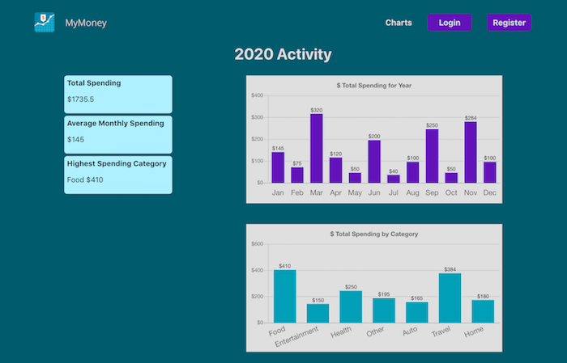
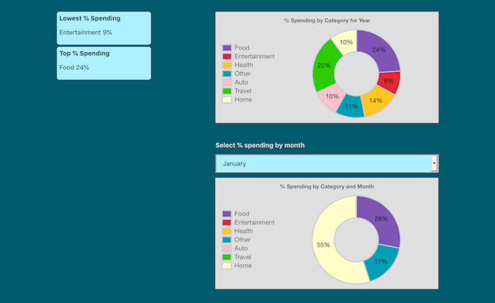

### MyMoney

#### Deployed here: https://my-money-mern.herokuapp.com/

```
A personal finance app to track your yearly spending habits. Enter transactions and view charts by month and category.
```

<p align="center">
    
</p>
<br>
<p align="center">
    
</p>

#### Technologies Used

```
Application: React, Node.js, Express, JavaScript, HTML, CSS
Database: MongoDB
Charting: Chart.js
```

#### Install

```bash
# Create a MongoDB database and cluster
    Copy and Save the connection string from Connect > Connect to your application. Paste this value for the mongoURI key.

# Clone repo

# Create .env file at root level of repo and set values for the following keys
    TOKEN_SECRET
    mongoURI
    secretOrKey

# Install dependencies for server
$ npm install

# Install dependencies for client
$ npm run client-install

# Run the client & server with concurrently
$ npm run dev

# Server runs on http://localhost:5000 and client on http://localhost:3000
```

```
Author: RunHannah
License: MIT License
```
